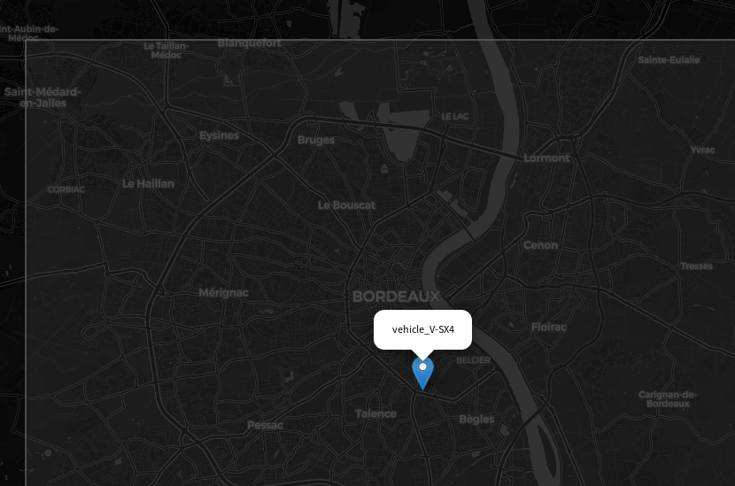

# Realtime Location Tracking

This project is a protocol design / network programming project. The goal is to
make geolocalisation servers and clients with zone overlaps and real-time
visualization. Multiple teams worked on different implementations following a
common specification. We did a final interoperability test with all the teams.
This server is implemented with Node.js, Socket.io, and Leaflet.

[Slides](doc/slides.pdf)

